# LifeHealth

LifeHealth is an enterprise-grade digital healthcare platform engineered to streamline patient appointment booking, doctor scheduling, electronic health records (EHR), clinical administration, and AI-assisted triage consultation. Built with a unified design system and powered by modern TypeScript microservices, LifeHealth connects patients, doctors, and healthcare administrators into a cohesive, responsive ecosystem.

> [!IMPORTANT]
> **Lưu ý:** Đây là dự án học tập và trình diễn kỹ thuật, không được xây dựng cho mục đích kinh doanh hoặc thương mại.
>
> **Notice:** This project is intended solely for educational and technical demonstration purposes, not for business or commercial use.

---

## Overview

Modern healthcare delivery demands friction-free access for patients and high-efficiency operational tools for clinicians and administrators. LifeHealth addresses both sides of the care equation:

- **For Patients:** An accessible, intuitive self-service portal for discovering verified specialists, scheduling consultations in seconds, maintaining longitudinal family health records, and communicating securely with care providers.
- **For Doctors:** A clinical workspace to manage daily queues, review patient histories, execute consultations, and leverage AI to summarize complex medical records and diagnostic files.
- **For Healthcare Administrators:** An enterprise control center offering operational visibility, granular Role-Based Access Control (RBAC with 130+ permissions), user lifecycle management, and automated AI clinical analytics and report generation.

---

## Key Features

### 🩺 Patient Experience
- **Specialist Discovery & Search:** Multi-criteria filtering by medical specialty, rating, experience, and real-time consultation availability.
- **Rapid Appointment Scheduling:** 10-second "Đặt lịch nhanh" modal with auto-suggested clinics, specialists, and available time slots.
- **Doctor Profile & Calendar Booking:** In-depth practitioner profiles detailing bio, qualifications, clinic location, pricing, and live interactive appointment slots.
- **Appointment Management:** Real-time lifecycle tracking (Chờ xác nhận, Đã xác nhận, Đã khám, Đã hủy) with visit history and cancellation controls.
- **Longitudinal Health & Family Records:** Unified health profile for patients and linked relatives tracking blood group, vitals, medical history, medications, and vaccination records.
- **Real-Time Doctor Messaging:** Instant messaging channel with active care specialists for pre- and post-visit inquiries.
- **LifeHealth MedAI Consultation:** 24/7 intelligent clinical assistant providing symptom triage, preliminary medical guidance, and clinic recommendations.
- **Account & Security Settings:** Personal profile management, notification preferences, and password security.

### 👨‍⚕️ Doctor Workspace
- **Clinical Dashboard & Consultation Queue:** Live view of daily appointments, pending patient arrivals, and consultation volume.
- **Schedule Management:** Flexible configuration of working days, session intervals, and consultation capacities.
- **AI Medical Record Summarizer:** Automated analysis of multi-page patient records, PDFs, and lab results with clinician verification safeguards.
- **Direct Patient Consultation:** Direct communication and follow-up consultation notes.

### 🛡️ Administrator Control Center
- **Operational Command Center:** Real-time metrics on patient throughput, booking trends, specialty demand, and revenue metrics.
- **Granular RBAC Governance:** Permission matrix managing 130+ fine-grained permissions across clinical, financial, and administrative operations.
- **Centralized Practitioner & User Management:** User directory with status toggling (active/locked), role assignment, and profile auditing.
- **Enterprise AI Report Engine:** Automated clinical and operational report generation with AI insights, interactive charts, and CSV/PDF export.
- **Audit Logs & Complaints Resolution:** Full administrative audit trails and patient feedback processing workflows.

---

## Patient Experience (Redesigned UI)

The Patient Portal (`frontend/`) has undergone a comprehensive redesign prioritizing clean healthcare aesthetics, calm visual hierarchy, WCAG-compliant readability, and effortless multi-step workflows.

### 1. Modern Portal Landing Page
The redesigned public landing page greets patients with clear care pathways, search by specialty, doctor recommendations, and health education articles.

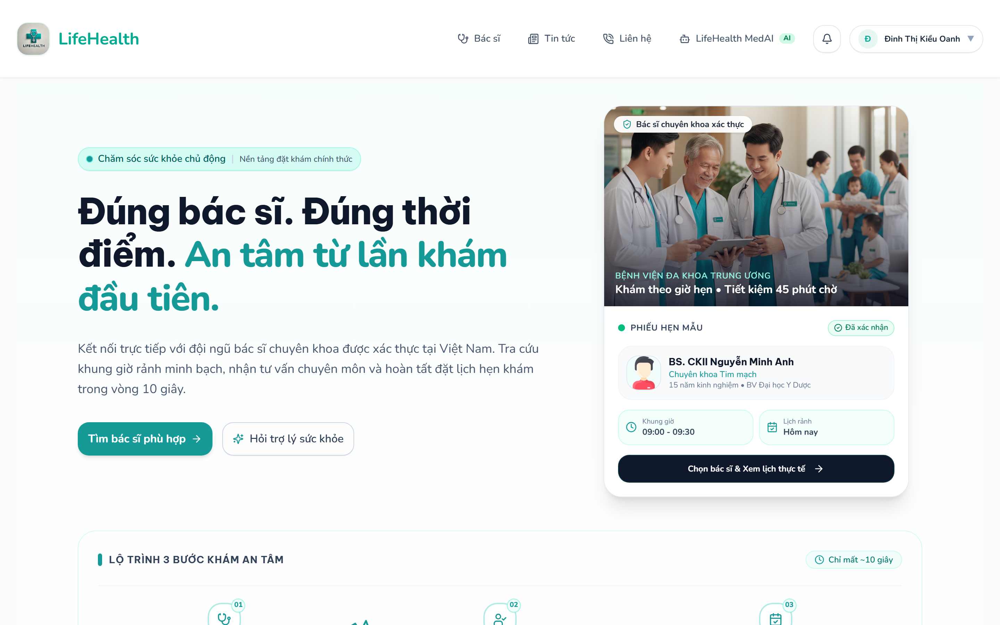

---

### 2. Unified Patient Dashboard
Once signed in, the patient dashboard provides an immediate overview of health vitals, active appointments, quick booking shortcuts, and personalized specialist recommendations.

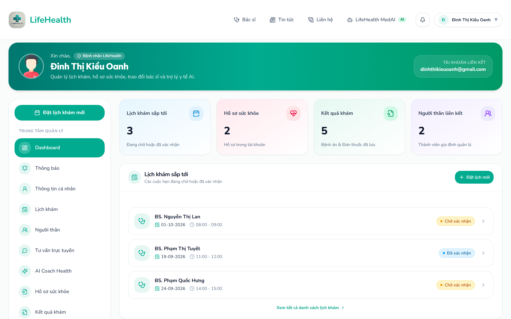

---

### 3. Specialist Discovery & Search
Patients can search, filter, and compare doctors across clinical specialties, experience levels, and ratings with live availability indicators.

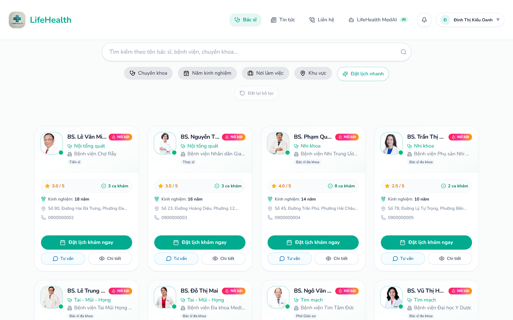

---

### 4. Specialist Profile & Consultation Schedule
Detailed doctor profile displaying medical qualifications, biography, consultation fee, clinic location, and an interactive schedule picker for available examination slots.

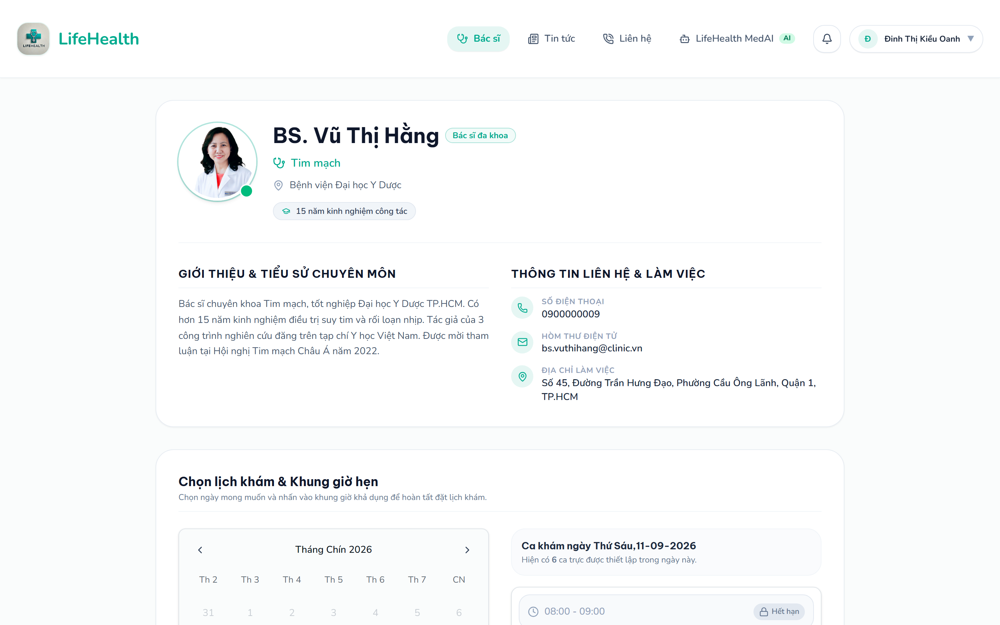

---

### 5. Interactive Appointment Booking Workflows
LifeHealth provides two seamless paths to schedule care: an accelerated quick booking dialog and a detailed doctor slot confirmation workflow.

| Quick Booking Modal ("Đặt lịch nhanh") | Slot Selection & Booking Confirmation |
| :---: | :---: |
| 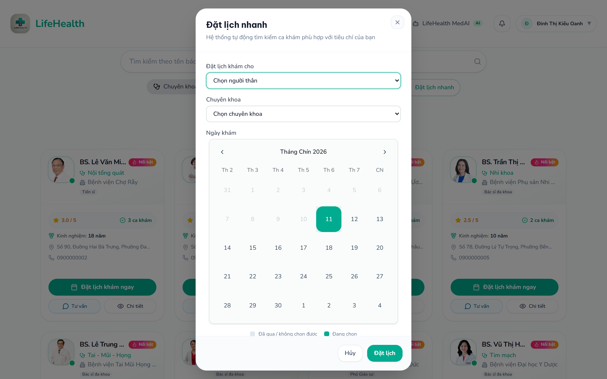 | 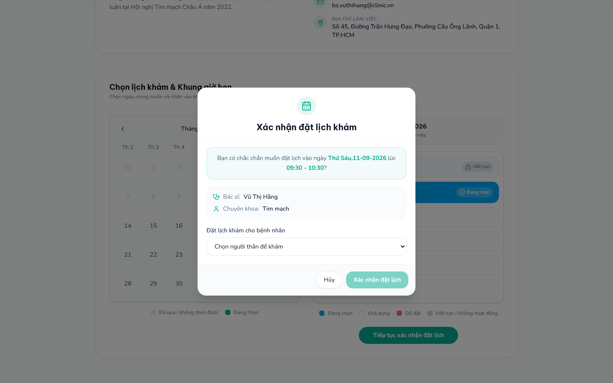 |
| *Rapid 10-second booking modal enabling instant relative selection, specialty filtering, and slot confirmation without leaving the page.* | *Selected consultation slot with patient notes, reason for visit, and booking confirmation dialog.* |

---

### 6. Appointment Management & Visit History
Patients can inspect upcoming appointments, filter by status (All, Pending, Confirmed, Completed, Cancelled), view clinic addresses, and manage their consultation itinerary.

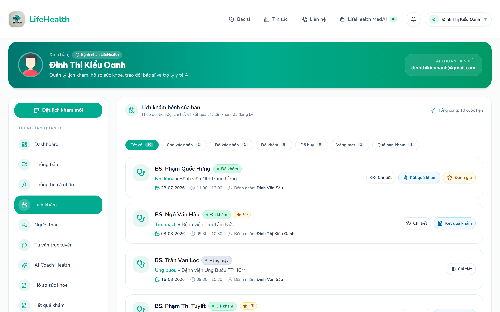

---

### 7. Direct Doctor-Patient Messaging
Built-in secure messaging enables direct communication between patients and their attending specialists for appointment questions, follow-up guidance, and preparation notes.

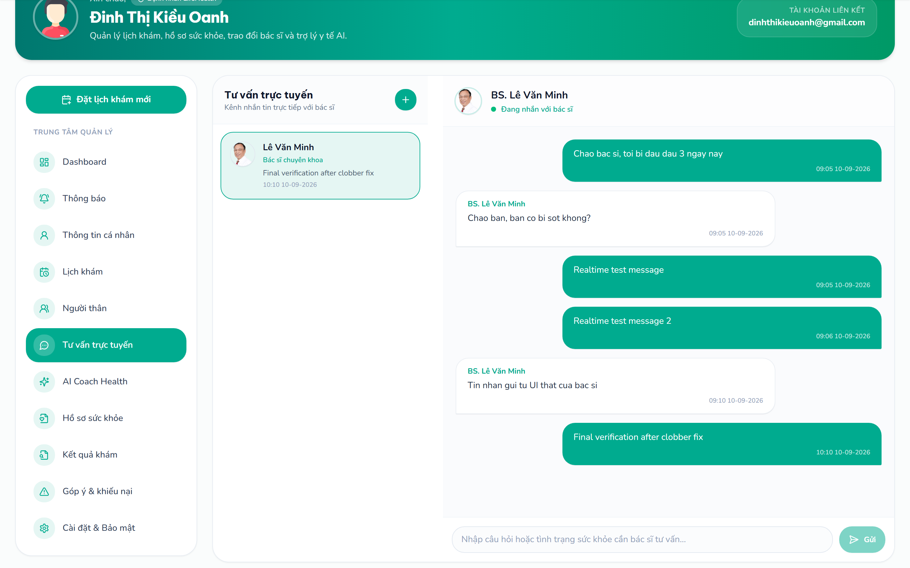

---

### 8. Longitudinal Health & Family Records
Comprehensive medical record tracking for the patient and linked family members, including blood type, height, weight, BMI, recent blood pressure, glucose levels, and active prescriptions.

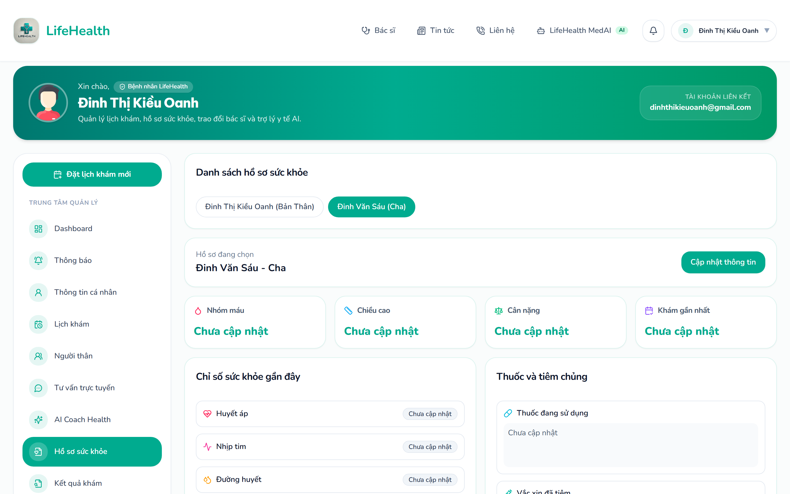

---

### 9. Account Profile & Personal Information
Dedicated profile management interface allowing patients to update identification details, contact information, addresses, and emergency contacts.

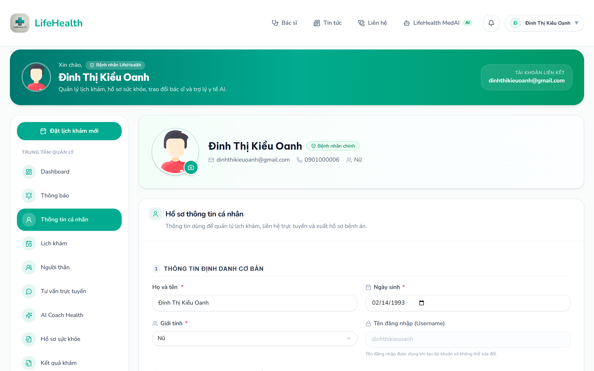

---

### 10. LifeHealth MedAI Consultation Assistant
An integrated AI assistant powered by LangGraph and RAG workflows that provides patients with 24/7 symptom assessment, medical context, and clinic guidance before booking.

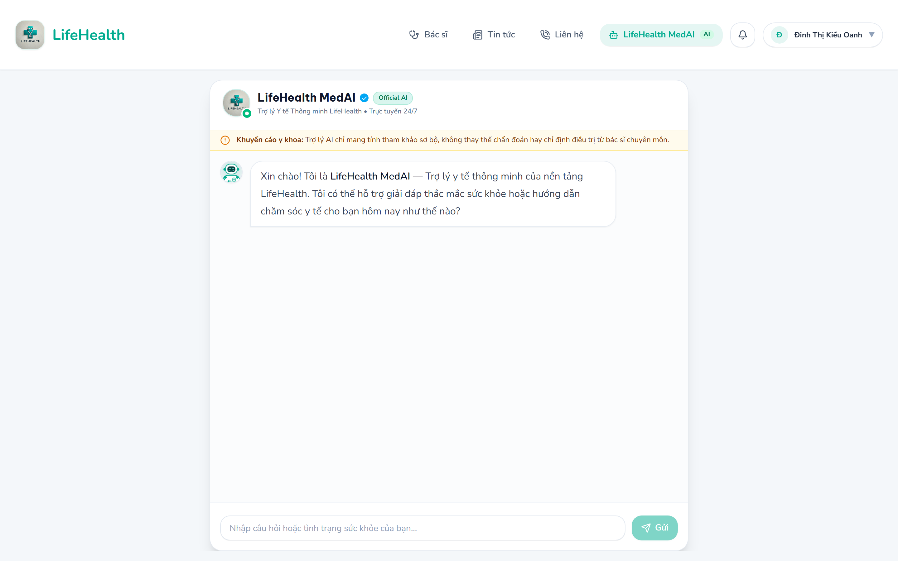

---

## Doctor & Administrator Workspaces

In addition to the patient experience, LifeHealth includes dedicated portals for healthcare providers and system operators.

### Doctor Experience

| Clinical Dashboard & Queue | AI-Assisted Medical Record Summary |
| :---: | :---: |
| 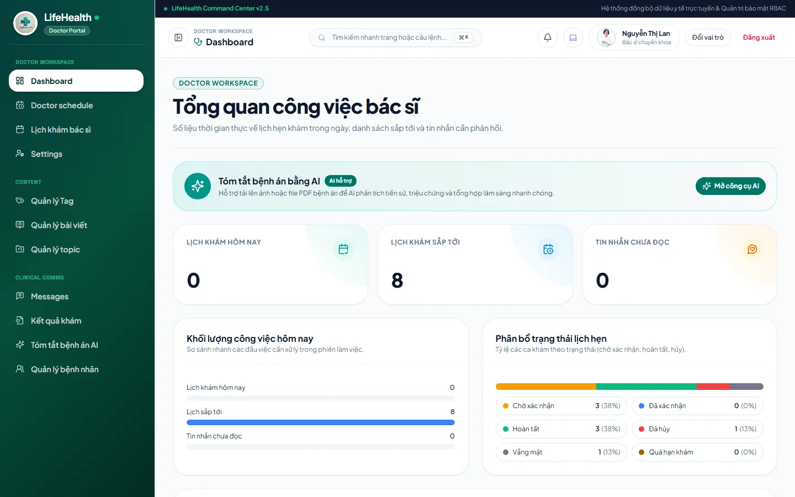 | 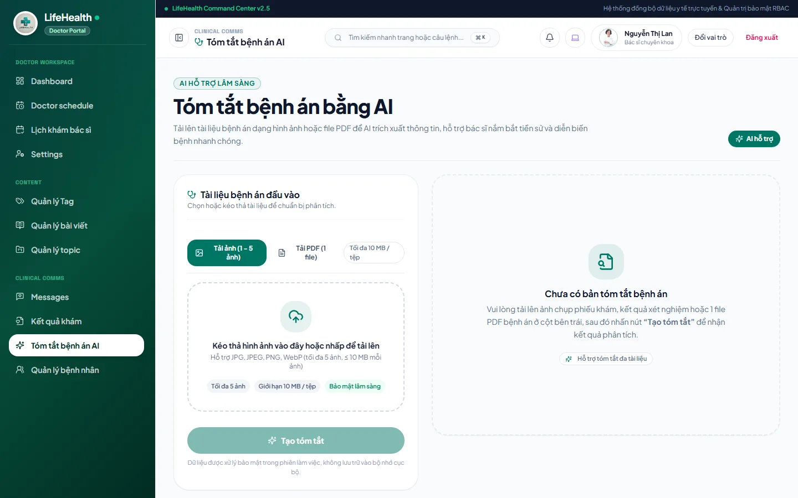 |
| *Daily clinical workspace tracking consultation volume, appointment statuses, and pending patient actions.* | *AI clinical summary tool parsing multi-page documents/PDFs with mandatory verification safeguards.* |

---

### Administrator Experience

| Operational Dashboard | Role & Permission Governance (RBAC) |
| :---: | :---: |
| 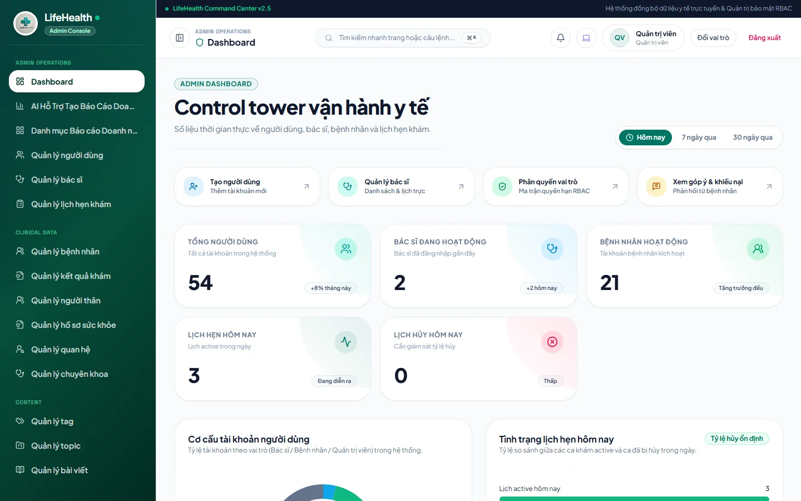 | 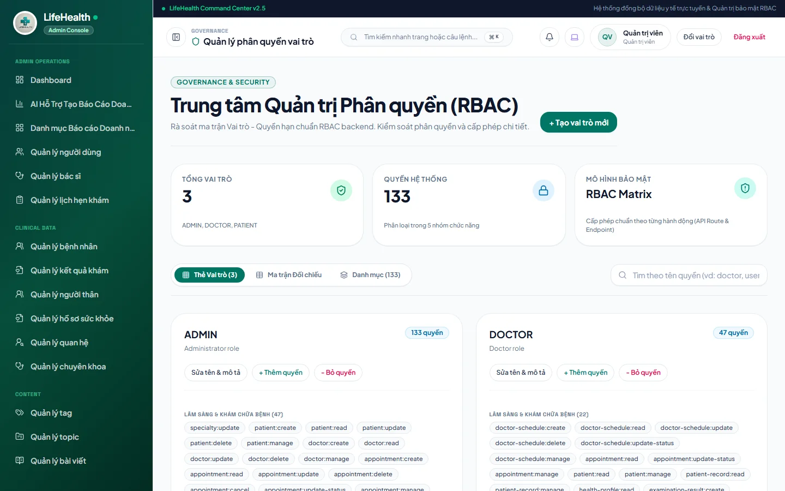 |
| *Real-time clinical control tower with active metrics, daily appointment tracking, and role breakdown.* | *Fine-grained RBAC matrix managing 130+ system permissions across clinical and administrative domains.* |

| Centralized User & Practitioner Management | AI Enterprise Report Generator |
| :---: | :---: |
| 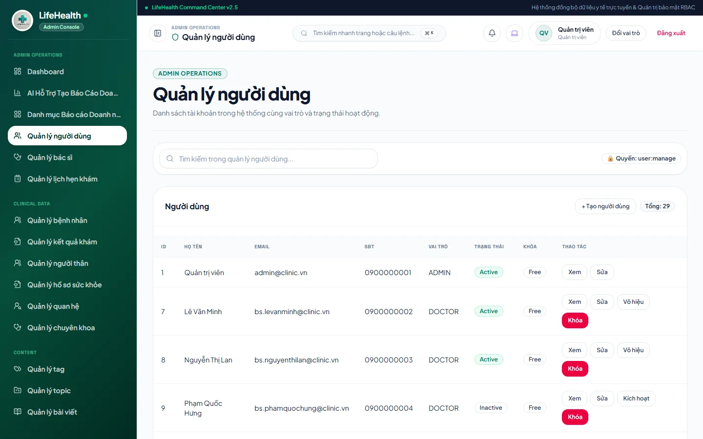 | 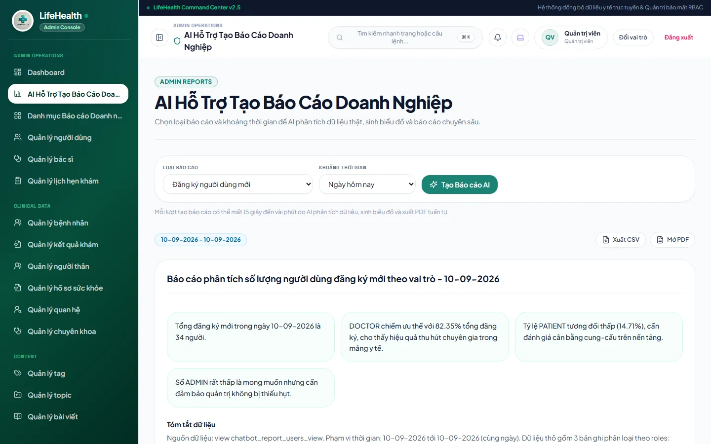 |
| *System user directory with lifecycle controls (lock/unlock, activation, and role assignments).* | *Automated clinical & operational reporting engine with AI insights, interactive charts, and CSV/PDF export.* |

---

## UI / UX Design System

The redesign of LifeHealth adheres to intentional healthcare design principles:

- **Calm & Trustworthy Palette:** Primary emerald and teal accents (`#059669`, `#0d9488`) combined with soft slate neutrals (`#f8fafc` to `#0f172a`), creating a soothing, medical-grade environment.
- **Visual Hierarchy & Typography:** Inter and Outfit typography pairings with deliberate type scale, prominent primary CTAs, and scannable data badges.
- **Micro-Interactions & State Polish:** Subtle transitions, skeleton loading placeholders, contextual error recovery banners, and expressive empty states.
- **Responsive & Accessible:** Fully responsive layouts spanning mobile, tablet, and 1440px desktop screens, with WCAG AA compliant contrast ratios and keyboard-accessible Radix UI primitives.

---

## Technology Stack

| Service | Architecture & Main Technologies |
| :--- | :--- |
| **Patient Application** (`frontend/`) | React 19, TypeScript, Vite, Tailwind CSS v4, TanStack Query v5, Zustand v5, Radix UI Primitives, React Hook Form, Zod, Lucide Icons, Socket.IO Client, Playwright |
| **Admin & Doctor Portal** (`admin/`) | React 19, TypeScript, Vite, Tailwind CSS v4, TanStack Query v5, Zustand v5, Chart.js, React Chartjs 2, Radix UI Primitives, Lucide Icons |
| **Backend REST API** (`backend/`) | NestJS 11, TypeORM, PostgreSQL 16, Redis 7, BullMQ, Passport JWT / Google OAuth, Socket.IO Gateway, Swagger / OpenAPI, Jest |
| **AI Chatbot Service** (`chatbot/`) | Express 5, TypeScript, LangChain, LangGraph, Qdrant Vector DB, OpenAI / Google Gemini / Ollama, Sharp, PDFKit, ChartJS Canvas |

---

## Architecture & System Design

```
                     ┌─────────────────────────────────────────┐
                     │            Clients & Browsers           │
                     └────┬───────────────────────────────┬────┘
                          │                               │
             HTTP / WS    │                  HTTP / WS    │
                          ▼                               ▼
       ┌──────────────────────────────┐ ┌──────────────────────────────┐
       │   Patient App (frontend/)    │ │    Admin Portal (admin/)     │
       │   React 19 + Vite (:5173)    │ │   React 19 + Vite (:4173)    │
       └──────────────┬───────────────┘ └──────────────┬───────────────┘
                      │                                │
                      └───────────────┬────────────────┘
                                      │ REST API / WebSocket
                                      ▼
                      ┌────────────────────────────────┐
                      │    NestJS Backend (backend/)   │
                      │         Port 3000 / 3010       │
                      └───────┬──────────────┬─────────┘
                              │              │
             ┌────────────────┴─────┐        │ Internal HTTP
             ▼                      ▼        ▼
┌─────────────────────────┐ ┌─────────────┐ ┌───────────────────────────┐
│ PostgreSQL 16 (Primary) │ │ Redis 7 DB  │ │  Chatbot Service (chatbot/)│
│   TypeORM Entities      │ │ Cache/Queues│ │  LangGraph + Qdrant (:5000)│
└─────────────────────────┘ └─────────────┘ └───────────────────────────┘
```

- **Backend (NestJS):** Domain modules under `src/modules/<feature>/`, centralized TypeORM entities in `src/entities/`, and versioned migrations in `src/database/migrations/`. Every endpoint is protected with cookie-based JWT authentication, granular RBAC decorators (`@Permissions`), and a standard response envelope `{ statusCode, success, data, error }`. Background mail and notifications run asynchronously via BullMQ.
- **Client Applications (React 19):** Strict one-way data architecture: `Page/Component → Custom Hook → TanStack Query → Axios API Client`. Zustand is isolated to client-only UI state, while server cache invalidation handles synchronicity. Validation schemas are formalized with Zod and React Hook Form.
- **AI Consultation Engine (LangChain/LangGraph):** State graph workflows orchestrating RAG queries over medical corpora, vector search in Qdrant, OCR on user-uploaded laboratory files, and PDF clinical report generation.

---

## Repository Layout

```text
.
├── frontend/               # Patient-facing React 19 application
│   ├── src/
│   │   ├── components/     # UI primitives, dialogs, layout, and notification cards
│   │   ├── pages/          # Patient dashboard, booking, health records, chat
│   │   ├── hooks/          # TanStack Query custom hooks
│   │   ├── schemas/        # Zod validation schemas
│   │   └── stores/         # Zustand UI stores
│   └── e2e/                # Playwright end-to-end tests
├── admin/                  # Doctor and Administrator React 19 application
│   ├── src/
│   │   ├── components/     # Clinical tables, charts, RBAC matrices, modals
│   │   ├── pages/          # Operational dashboard, user management, reports
│   │   └── hooks/          # TanStack Query custom hooks
├── backend/                # NestJS REST API and WebSocket server
│   └── src/
│       ├── modules/        # Feature modules (auth, appointments, users, etc.)
│       ├── entities/       # TypeORM relational entities
│       ├── database/       # Migrations, seed data, and data-source
│       └── common/         # Auth guards, RBAC interceptors, DTO filters
├── chatbot/                # AI consultation and clinical report service
│   └── src/                # LangGraph agents, RAG pipelines, Qdrant vectors
├── docs/                   # Product documentation and screenshots
│   ├── screenshots/patient/# Redesigned Patient UI presentation captures
│   └── images/             # Admin and Doctor workspace captures
└── docker-compose.dev.yml  # Multi-service container orchestration
```

---

## Prerequisites

- **Node.js:** `v20.x` or newer
- **Package Manager:** `npm` (v10+)
- **Container Runtime:** Docker Desktop with Docker Compose (recommended)
- **Database & Cache:** PostgreSQL 16 and Redis 7 (when running without Docker)

---

## Environment Configuration

Copy the example environment files for all four services:

```bash
cp frontend/.env.example frontend/.env
cp admin/.env.example admin/.env
cp backend/.env.example backend/.env
cp chatbot/.env.example chatbot/.env
```

### Environment Variable Guide

| File | Key Variables | Description |
| :--- | :--- | :--- |
| `frontend/.env` | `VITE_BACKEND_URL` | Backend API base URL (e.g. `http://localhost:3000` or `http://localhost:3010`) |
| `admin/.env` | `VITE_BACKEND_URL` | Backend API base URL for administrator portal |
| `backend/.env` | `DB_HOST`, `DB_PORT`, `DB_USERNAME`, `DB_PASSWORD`, `DB_DATABASE` | PostgreSQL connection parameters |
| `backend/.env` | `REDIS_HOST`, `REDIS_PORT` | Redis cache and queue connection |
| `backend/.env` | `JWT_SECRET`, `JWT_EXPIRES_IN` | Session token signing secret and duration |
| `backend/.env` | `GOOGLE_CLIENT_ID`, `GOOGLE_CLIENT_SECRET`, `GOOGLE_CALL_BACK` | Google OAuth credentials (optional for dev) |
| `chatbot/.env` | `OPENAI_API_KEY` / `GEMINI_API_KEY` | LLM provider API credentials |
| `chatbot/.env` | `QDRANT_URL`, `QDRANT_API_KEY` | Vector database configuration |

> [!CAUTION]
> Never commit populated `.env` files or real production credentials to version control.

---

## Quick Start with Docker

The fastest way to launch the entire ecosystem (all 4 services + PostgreSQL + Redis + pgAdmin + RedisInsight):

```bash
docker compose -f docker-compose.dev.yml up --build
```

To stop all containers:

```bash
docker compose -f docker-compose.dev.yml down
```

*(Add `-v` to the down command only if you wish to reset persistent PostgreSQL/Redis database volumes).*

### Development URLs

The Docker Compose configuration maps services to dedicated host ports to prevent collisions with local development servers:

| Service | Docker Compose URL | Native Dev URL |
| :--- | :--- | :--- |
| **Patient Application** | `http://localhost:5183` | `http://localhost:5173` |
| **Admin & Doctor Portal** | `http://localhost:4183` | `http://localhost:4173` |
| **Backend REST API** | `http://localhost:3010/api/v1` | `http://localhost:3000/api/v1` |
| **Swagger API Documentation** | `http://localhost:3010/api-docs` | `http://localhost:3000/api-docs` |
| **AI Chatbot Service** | `http://localhost:5000/chatbot` | `http://localhost:5000/chatbot` |
| **pgAdmin 4** | `http://localhost:8000` | — |
| **RedisInsight** | `http://localhost:5540` | — |

---

## Running Services Locally (Native)

To run the application services directly on your host machine:

### 1. Start Infrastructure Containers
```bash
docker compose -f docker-compose.dev.yml up -d postgres redis pgadmin redisinsight
```

### 2. Install Dependencies
```bash
npm --prefix frontend ci
npm --prefix admin ci
npm --prefix backend ci
npm --prefix chatbot ci
```

### 3. Start Each Service
Run each command in a separate terminal:

```bash
# Terminal 1: Backend API
npm --prefix backend run start:dev

# Terminal 2: AI Chatbot Service
npm --prefix chatbot run dev

# Terminal 3: Patient Frontend
npm --prefix frontend run dev

# Terminal 4: Admin & Doctor Frontend
npm --prefix admin run dev
```

---

## Build, Test, and Quality Assurance

### Bundle Compilation
```bash
# Build React clients
npm --prefix frontend run build
npm --prefix admin run build

# Build Backend API
npm --prefix backend run build
```

### Code Formatting & Linting
```bash
# Lint frontend and admin applications
npm --prefix frontend run lint
npm --prefix admin run lint

# Lint backend TypeScript source
npm --prefix backend run lint
```

### Automated Testing
```bash
# Run backend unit tests and coverage report
npm --prefix backend run test
npm --prefix backend run test:cov

# Run Patient app Playwright end-to-end test suite
npm --prefix frontend run test:e2e

# Run Playwright interactive UI test runner
npm --prefix frontend run test:e2e:ui
```

---

## Database Migrations

Database schema changes are tracked via TypeORM migrations in `backend/src/database/migrations/`:

```bash
# Apply pending migrations
npm --prefix backend run migration:run

# Revert the latest migration
npm --prefix backend run migration:revert

# Generate a migration from entity diffs
npm --prefix backend run migration:generate -- -n MigrationName
```

---

## Security, Privacy & Medical Data Safety

- **Data Privacy:** All screenshots, test accounts, and demonstration records use synthetic, anonymized identities (e.g. `dinhthikieuoanh@gmail.com`). No real protected health information (PHI) or personal identifiers are stored or committed.
- **Authentication & Authorization:** Secure `HttpOnly` and `SameSite` cookie-based JWT sessions prevent XSS token theft. RBAC is enforced server-side via NestJS guards.
- **Safe AI Diagnostics:** AI outputs in MedAI and doctor record summaries are strictly auxiliary and surfaced with clear clinical disclaimers requiring licensed practitioner verification.

---

## Contributing

Please review [AGENTS.md](AGENTS.md) for architectural guidelines, branch conventions, and testing expectations before submitting pull requests.

For deep client-side conventions:
- Patient portal conventions: [frontend/AGENTS.md](frontend/AGENTS.md)
- Admin/Doctor workspace conventions: [admin/AGENTS.md](admin/AGENTS.md) and [admin/DESIGN.md](admin/DESIGN.md)

---

## License

This project is licensed under the MIT License for educational and portfolio demonstration purposes.
